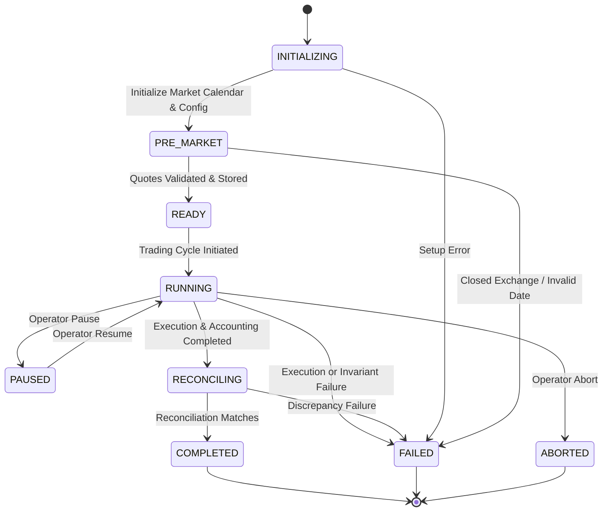

# APEX-QUANT — Step 13: Extended Paper Trading Architecture & Operations Manual

## 1. System Overview

Step 13 extends APEX-QUANT from a single-cycle paper trading proof-of-concept (Step 12) into a robust, multi-session quantitative simulation and operational orchestration capability.

```
┌────────────────────────────────────────────────────────────────────────┐
│              Multi-Session Simulation Engine (Step 13)                 │
└──────────────────────────────────┬─────────────────────────────────────┘
                                   │
                                   ▼
┌────────────────────────────────────────────────────────────────────────┐
│                        Session State Machine                           │
│  INITIALIZING ──► PRE_MARKET ──► READY ──► RUNNING ──► RECONCILING     │
│       │                 │          │           │            │          │
│       └─────────────────┴──────────┴───────────┴────────────┴──►FAILED │
│                                                                 COMPLETED
└──────────────────────────────────┬─────────────────────────────────────┘
                                   │
                                   ▼
┌────────────────────────────────────────────────────────────────────────┐
│                     Sequential Market Cycles                           │
│  Point-in-Time Data (<= T) ──► Features ──► ML Walk-Forward ──► Ranking│
│                                                                        │
│  Target Portfolio ──► 12-Point Pre-Trade Risk ──► Order Management     │
│                                                                        │
│  Virtual Execution ──► Accounting Invariants ──► Double-Entry Recon    │
└──────────────────────────────────┬─────────────────────────────────────┘
                                   │
                                   ▼
┌────────────────────────────────────────────────────────────────────────┐
│                    Operational Reliability Layers                      │
│  19-Metric Telemetry Tracker │ Atomic Disk Persistence │ Restarts      │
└────────────────────────────────────────────────────────────────────────┘
```

### Safety & Operational Boundaries
- **Strictly Paper-Only**: Live execution is disabled at both the broker and engine levels. `LiveTradingDisabledError` is enforced whenever an adapter declares live order support.
- **Zero Real Broker Credentials**: No Kite, Upstox, or live broker credentials, secrets, or network connections exist in the codebase.
- **Binance Bot Quarantine**: The legacy BTC Binance testnet bot remains completely isolated and untouched.

---

## 2. Session Lifecycle State Machine

The session engine enforces explicit state progression through `SessionTransitionValidator`. Any illegal transition raises an `InvalidSessionTransitionError` and immediately halts execution fail-closed.



### Transition Rules
| Source State | Allowed Target States | Behavior on Error |
|---|---|---|
| `INITIALIZING` | `PRE_MARKET`, `FAILED`, `ABORTED` | Fail closed, record error |
| `PRE_MARKET` | `READY`, `FAILED`, `ABORTED` | Skip closed exchange days safely |
| `READY` | `RUNNING`, `FAILED`, `ABORTED` | Quarantines bad quotes before orders |
| `RUNNING` | `PAUSED`, `RECONCILING`, `FAILED`, `ABORTED` | Preserves accounting snapshot |
| `PAUSED` | `RUNNING`, `FAILED`, `ABORTED` | Safe operator hold |
| `RECONCILING`| `COMPLETED`, `FAILED`, `ABORTED` | Flags unverified state |
| `COMPLETED` | *None (Terminal)* | Immutable audit record |
| `FAILED` | *None (Terminal)* | Immutable audit record |
| `ABORTED` | *None (Terminal)* | Immutable audit record |

---

## 3. Crash Interruption & Restart Recovery Design

The engine is engineered and verified across 7 distinct process crash boundaries:

```
Cycle Start
    │
    ├─► [Boundary 1] Before order submission ──► Restart loads clean initial state
    │
    ├─► [Boundary 2] After order submission  ──► Restart loads pending orders without re-submission
    │
    ├─► [Boundary 3] After fills             ──► Restart loads executed fills without doubling
    │
    ├─► [Boundary 4] Before accounting       ──► Restart computes balances from recorded fills
    │
    ├─► [Boundary 5] After accounting        ──► Restart preserves exact cash and NAV marks
    │
    ├─► [Boundary 6] Before reconciliation   ──► Restart executes startup reconciliation audit
    │
    └─► [Boundary 7] After reconciliation    ──► Restart verifies state clean; zero re-execution
```

### Recovery Guarantees
1. **Idempotency Keys**: UUIDv5 and timestamp keys prevent duplicate order entry.
2. **Atomic Disk Persistence**: State is written via temporary files and `os.replace`, guaranteeing crash resistance against partial sector writes.
3. **Startup Auto-Reconciliation**: Upon process restart with `auto_load_state=True`, an automatic reconciliation audit runs immediately against current broker accounting.

---

## 4. Financial Accounting Invariants

Every simulated session rigorously enforces four non-negotiable financial accounting invariants:

1. **Cash Non-Negativity**: `account.cash >= -0.01` (borrowing / negative cash balance strictly prohibited).
2. **Long-Only Sizing**: For all portfolio positions $p \in P$, `p.shares >= 0` (short selling prohibited).
3. **Total Equity Balance**:
   $$\text{Total Equity} = \text{Cash} + \sum_{p \in P} (\text{Shares}_p \times \text{Mark Price}_p)$$
   Verified within ₹1.00 floating point tolerance.
4. **Zero Leverage (Gross Exposure $\le 100\%$)**:
   $$\text{Gross Exposure} = \frac{\sum_{p \in P} \text{Market Value}_p}{\text{Total Equity}} \le 1.00$$

---

## 5. 19-Metric Operational Telemetry

Thread-safe operational telemetry is tracked in real-time by `PaperOperationalTelemetry` and exposed via `GET /api/paper/telemetry`:

| Metric Category | Metrics Tracked |
|---|---|
| **Sessions** | `sessions_started`, `sessions_completed`, `sessions_failed` |
| **Cycles** | `cycles_started`, `cycles_completed` |
| **Orders & Execution** | `orders_generated`, `orders_filled`, `orders_rejected` |
| **Idempotency & Risk** | `duplicate_orders`, `risk_rejections` |
| **Subsystem Errors** | `data_errors`, `model_errors`, `execution_errors`, `reconciliation_errors` |
| **Recovery & Latency** | `restart_recoveries`, `average_cycle_latency`, `maximum_cycle_latency` |
| **Universe Throughput**| `symbols_processed`, `symbols_rejected` |
| **Operational State** | `current_session`, `current_cycle`, `current_state`, `last_successful_cycle`, `last_error`, `last_reconciliation_status` |

---

## 6. Simulated Performance Reporting

The reporting module produces standardized `PaperPerformanceReport` structures:
- Explicit disclaimer: `"SIMULATED PAPER PERFORMANCE — Research & operational validation only. Zero real execution, zero profitability guarantees."`
- Tracks NAV trajectory, total return, realized/unrealized P&L, transaction fees (10 bps), slippage (5 bps), annualized volatility, Sharpe, Sortino, and maximum drawdown.
- No fabricated benchmarks or exaggerated return claims.
